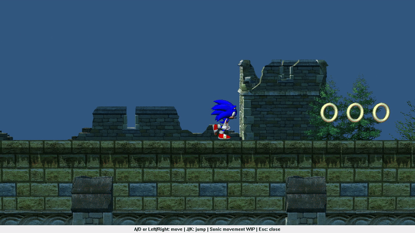
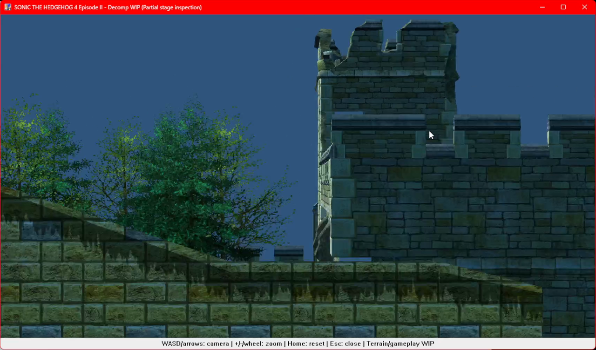
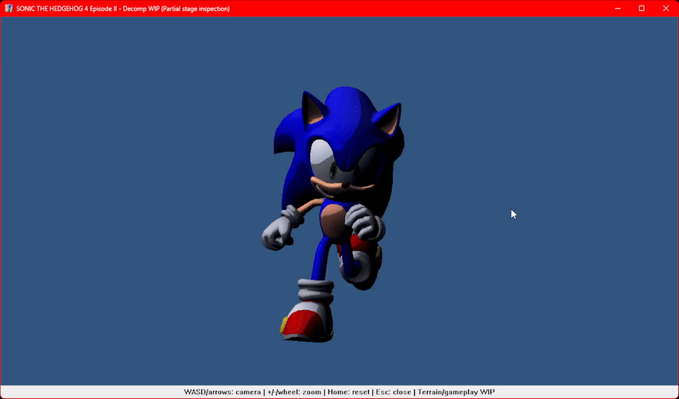

# Sonic 4: Episode II

Experimental reconstruction of Sonic 4: Episode II in **C++17**, with a Windows
Direct3D 9 preview, an earlier C#/MonoGame prototype and Python format tools.
The final Steam PC release is the behavior and presentation target.

**Updated 15 September 2026.** This is a work in progress, not a complete game.
Original game executables and extracted assets are not included.

## Branches

- **main**: current native implementation, supporting tools and managed code.
- **[phase1-prototype](https://github.com/JohnHawaiiB-luga/Sonic4Episode2/tree/phase1-prototype)**:
  the published C#/MonoGame prototype as it stood on 29 July 2026.

## Current state

The native preview supports a limited first-act scene with Sonic movement,
terrain collision, crouching, rolling, spindash, wall/ceiling detachment,
surface-relative jumping, airborne movement and landing. Rings, selected sound
effects and ring/jump-dash particles are connected.

Homing calculations and target selection are implemented; real spring targets
and their contact/launch behavior are the next integration step. A complete act,
Tails, full menus/HUD, bosses and complete original rendering remain unfinished.
Unsupported behavior stays guarded. [Development status](DEVELOPMENT.md) describes
the remaining scope and verification limits.

## Captures

September 14 native movement and ring collection. Select the image to open the
10-second GIF (30 MB).

The September 13 captures below show separate native stage and character
inspection modes. They predate the connected movement work above.

## Build and run

The native Windows build requires Visual Studio 2022 C++ tools, a Windows SDK,
CMake 3.20 or newer and PowerShell 7. Provide your own compatible PC game files;
the data root must contain the unpacked stage, character, shader and sound folders.

~~~powershell
$gameRoot = 'C:\path\to\your\game-data'
$originalExecutable = 'C:\path\to\your\Sonic.exe'

pwsh -NoProfile -File tools/build-native-game.ps1 `
  -GameRoot $gameRoot -OriginalExecutable $originalExecutable -Architecture x64

& .\out\native-game-x64\Release\Sonic-Decomp.exe `
  --data-root $gameRoot --player-scene
~~~

Use A/D or Left/Right to move, S/Down to crouch, J/K to jump, and Esc to close.
The executable also offers `--character-inspection`; omit both mode flags for
stage inspection. Use `-Architecture Win32` for a 32-bit build.

Component tests do not require game files:

~~~powershell
cmake -S src/Sonic4Episode2.Native -B out/native -G "Visual Studio 17 2022" -A Win32 -DBUILD_TESTING=ON
cmake --build out/native --config Release --parallel 2
ctest --test-dir out/native -C Release --output-on-failure

dotnet test src/Sonic4Episode2.Tests/Sonic4Episode2.Tests.csproj -c Release
python -m unittest tools.test_cri tools.test_runtime_coverage
~~~

The managed projects require .NET 8. The Android project belongs to the earlier
managed prototype; native mobile builds are not ready.

## Repository layout

| Path | Contents |
|---|---|
| src/Sonic4Episode2.Native/ | Native game logic, asset readers, renderer, audio and component tests |
| src/Sonic4Episode2.Core/ | Managed prototype engine and format readers |
| src/Sonic4Episode2.Desktop/ | MonoGame desktop prototype |
| src/Sonic4Episode2.Android/ | Managed Android project |
| src/Sonic4Episode2.Tests/ | Managed tests |
| tools/ | Python format tools and PowerShell build/capture scripts |
| docs/ | Format documentation and development captures |

## References and credits

Episode II compiled code and observed behavior define the target. Related
Episode I implementations help locate shared concepts; differences still require
Episode II verification. Reconstructed source is written independently, and
reference binaries, extracted data and private analysis stay outside the repository.

- **WamWooWam**, for [Sonic 4 Episode 1 Deluxe](https://github.com/WanKerr/Sonic4Episode1).
- **TGEnigma**, for the [Episode I Windows Phone decompilation](https://github.com/TGEnigma/Sonic4Ep1-WindowsPhone-Decompilation).
- **Hidden Palace** and **Obscure Gamers**, for prototype preservation.

Sonic the Hedgehog and the original game belong to SEGA. This project is unofficial.
