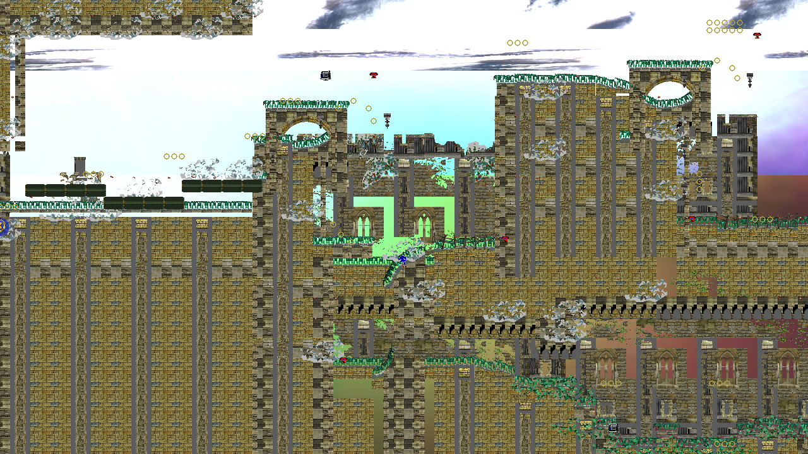
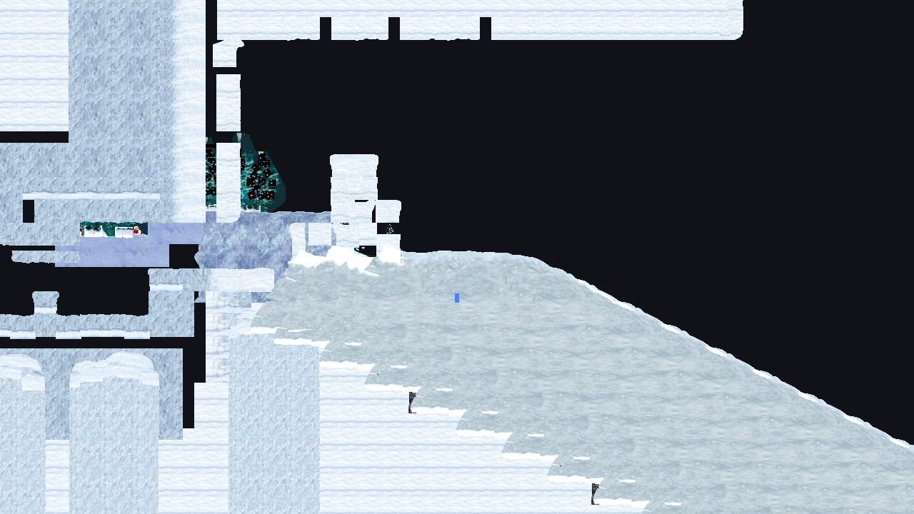
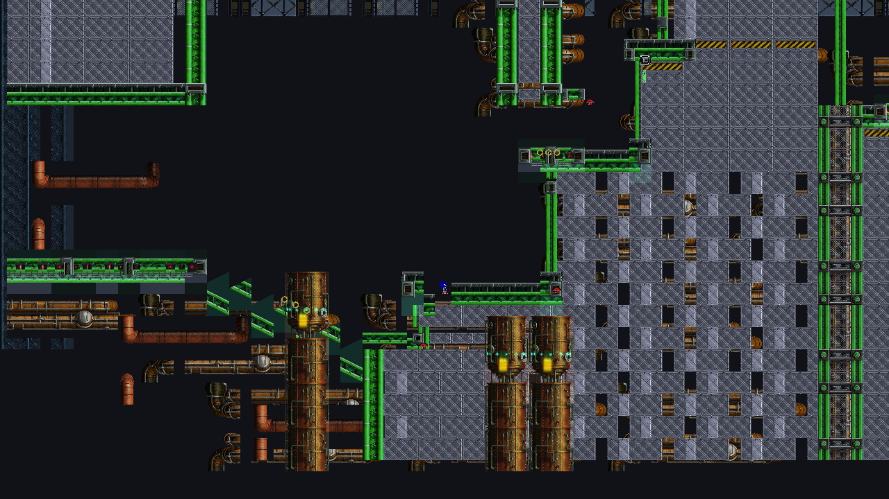
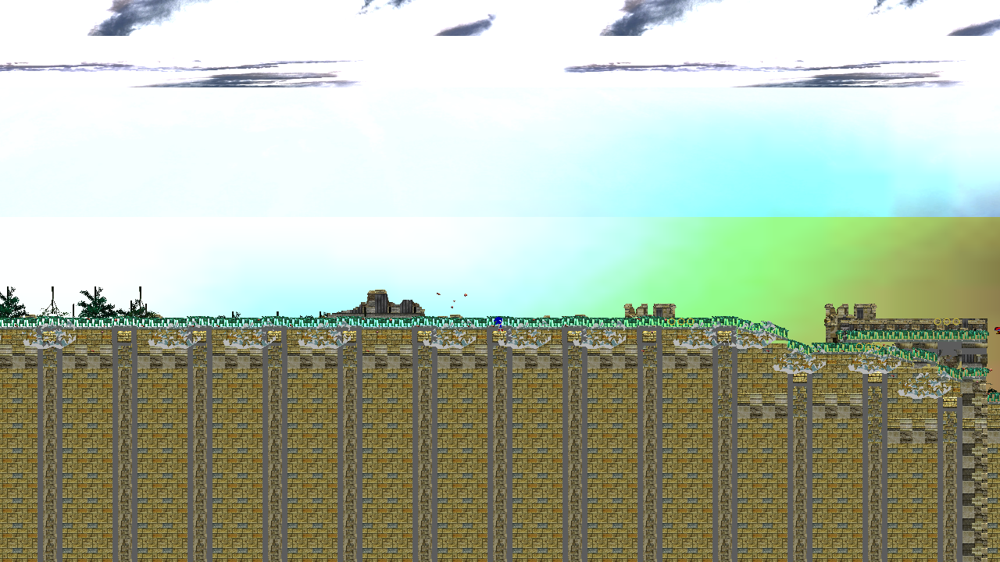
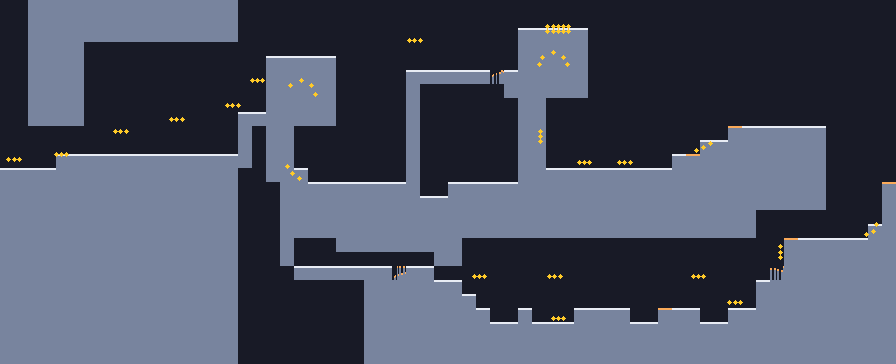
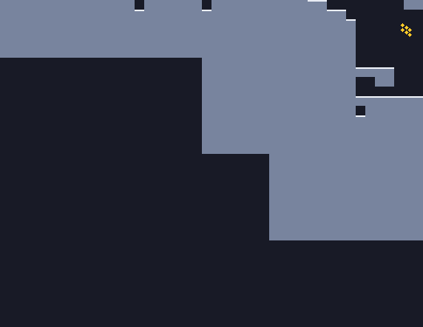

# Sonic 4: Episode II

A **clean-room, reverse-engineered reimplementation** of Sonic the Hedgehog 4:
Episode II — the game pulled apart and rebuilt from scratch as portable C# source,
so it outlives its original builds and runs on desktop and on things that fit in
your pocket.

## What this is (and what it is not)

This is a **reimplementation / source port**, not a matching decompilation — and
that is the correct approach for this game, not a compromise:

- **Episode I** could be a *decompilation* because its source was a **managed
  .NET build** (the older mobile lineage), which decompiles back to C# almost
  losslessly. That is also why the Episode I decomp is the pre-HD mobile version.
- **Episode II has no managed build to decompile.** Every Episode II binary is
  **native** compiled C++ — the x86 PC/console line and the ARM Android library.
  The one managed port that would have existed, Windows Phone 7, was cancelled.
  Native code does not decompile to clean, buildable source.

So Episode II gets the thing that *does* work: a from-scratch reimplementation
that reproduces the game 1:1 in behaviour, built by reading the original binaries
and data as **oracles** — never transcribing them. It is based on the **PC build
(the HD/console lineage)**, so it targets the definitive version of the game, not
the dated mobile one, and — like the Episode I decomp — it runs on phones.

The payoff is identical to a decompilation's: total control of the engine and every
system, modding far beyond asset swaps, translations, quality-of-life features,
debugging, and — above all — **preservation**. Episode I and II were pulled from
the mobile stores years ago; the official builds are already vanishing. This is the
copy that survives, and that you own.

### The roadmap — a two-act arc

- **Act 1 (in progress):** the portable reimplementation. Delivers the whole point
  — a faithful, moddable, preservation-grade Episode II on desktop and mobile.
- **Act 2 (a future stretch, now made possible):** an optional *matching*
  decompilation. A developer build of the Android port surfaced with its full
  symbol table intact — 24,263 named functions — which is the single asset that
  makes a rigorous matching decomp of this game tractable at all. Act 1 produces
  exactly the understanding Act 2 would need, so nothing here is wasted toward it.

The rest of this document is the engineering record of Act 1.


*Sylvania Castle Act 1, drawn entirely from data this project decoded: every
solid surface from the stage's own collision files, with its 325 rings where the
level designer put them. Nothing here is traced or redrawn.*

# Status

**≈70% through the reverse engineering; ~46% rendering fidelity.** Two separate
numbers on purpose: the first is how much of the game has been decoded out of its
files, the second is how close the picture is to the original. 193 tests, all
green. Every number below is verified against the *entire* data set, not one lucky
file.

**Formats — decoded and verified across the whole build:**

 - AMB archives — **1614/1614** parse, extraction lossless
 - Stage tile grids — **400/400** resolve exactly; stages are grids of 3D models
 - Texture banks — **651/651**; textures — **2853/2853** decode
 - NN model containers — **5727/5727**; geometry from **3546** models
 - **Node hierarchies, skinning weights + blend indices, and motion keyframes** —
   animation decoded and sampling; rigid models pose and animate
 - **Collision** — height fields and per-cell surface angles, cross-validated
   over 23,474 cells
 - Shaders — **1843/1843** parse as clean SM3.0
 - Material blend modes, CRI audio containers, DDS

**Recovered from the game's own binary, not guessed:** the object dispatch table
(803 slots), the player physics table (3 characters × 11 modes), the spin-dash
formula, collision addressing, the `.EV` record layout, and a 390-entry asset
manifest.

**What plays.** An act mounts from the original archives and Sonic **runs, jumps,
rolls and spin-dashes** on real geometry, following per-column heights and stored
slope angles with Episode II's own recovered physics. **Rings** collect and
trigger Super at 50; **springs** launch, **dash panels** boost. The player
**spawns at the act's real start marker and clears the act at the real goal
panel** — Zone 1 Act 1 is playable start to finish. Placed **gimmicks render and
animate**, and the **sky** draws from the far-background archive. Still missing:
damage, enemies, bosses, most of the 382 object behaviours, and a skinned
character model (the player is a placeholder). **A slice of a game, becoming a
game.**

**Mobile.** The core and renderer are fully filesystem-free; `Sonic4Episode2.Android`
**builds a signed APK**. Not yet run on a device. See `docs/MOBILE.md`.

Tools are Python with zero dependencies. `stagemap.py` renders layers to PNG,
which is the fastest way to find out whether a decode is real or whether you have
been staring at noise for an hour.

# Why this isn't a decompilation

Because it can't be, and it's worth being upfront about that.

Episode I is decompilable for exactly one reason: its Windows Phone 7 build. WP7
banned native code, so everything shipped as managed .NET, and managed assemblies
keep the metadata that lets ILSpy hand you back near-original C#.

Episode II never shipped on a platform with that restriction. Windows, PS3, 360,
iOS, Android, Ouya, Shield — all native C++. A Windows Phone port was announced
and then quietly cancelled, which is the single most annoying fact in this repo.
`Sonic.exe` is native x86 out of Visual C++ 2008 with no PDB, no RTTI on game
classes, and `/LTCG` smearing 663 translation units together. There is no button
that turns that back into source.

So this is a **re-implementation**, guided by reverse engineering. Different
method, same destination.

# The trick that makes it possible

Both episodes run SEGA's AliceNN engine. Episode II's own binary admits it — an
assert left the path `e:\sega\sonic4ep2-beta\program\library\alicenn\...` sitting
in `.rdata`. And Episode I's decompilation contains that same engine already
recovered into readable C#.

Better still, the data conventions are identical. Episode I's source references
`G_COM/MENU/G_PAUSE.AMB` and `G_ZONE2/BOSS/BOSS02.AMB` — directories this build
ships verbatim.

So Episode I gets used as a **behavioural oracle**: read it to learn what a
format or subsystem *means*, then write our own implementation and verify it
against Episode II's actual bytes. Every format here was confirmed that way
before being written down. Where the two disagree, Episode II's data wins.

# Credit where it's absolutely due

This project stands entirely on work other people did first, and it would not
exist otherwise.

 - **WamWooWam**, for [Sonic 4 Episode 1 Deluxe](https://github.com/WanKerr/Sonic4Episode1)
   — the clean, well-split Episode I decompilation that serves as the oracle for
   basically everything here. Released into the public domain, which is a
   generosity worth calling out.
 - **TGEnigma**, for the [original Episode I decompile](https://github.com/TGEnigma/Sonic4Ep1-WindowsPhone-Decompilation)
   that the above was built in response to.
 - **Hidden Palace** and **Obscure Gamers**, for preserving the prototypes.

Reading someone else's decompilation of the sibling game is a wildly unfair
advantage and I'm not going to pretend otherwise.

# What's actually in here

| | |
|---|---|
| `tools/amb.py` | AMB archive reader — list, extract, bulk unpack, verify |
| `tools/stagemap.py` | stage grids, object placement, tileset resolution, PNG previews |
| `tools/txb.py` | texture banks |
| `tools/nn.py` | SEGA NN models — containers, geometry, nodes, textures, OBJ export |
| `tools/stageview.py` | assembles a whole stage from grid + models, OBJ and PNG |
| `tools/shader.py` | D3D9 shader bytecode — parse, verify, opcode census |
| `tools/dds.py` | DXT1/3/5 and uncompressed DDS decoding, PNG export |
| `tools/dispatch.py` | object id → engine class, from the Android build's dispatch table |
| `docs/` | format specifications, all marked VERIFIED / INFERRED / OPEN |
| `docs/ORACLES.md` | the reference binaries — what a `.so` is, and how ELF cracked blockers |
| `plans/EXECPLAN.md` | the roadmap and why the PC build was chosen |

```sh
python tools/amb.py verify .
python tools/stagemap.py render  G_ZONE1/MAP/ZONE11_MAP.AMB out/ --scale 2
python tools/stagemap.py tileset G_ZONE1/MAP/ZONE11_MAP.AMB
python tools/txb.py    list      G_ZONE1/MAP/ZONE1_T.AMB
python tools/nn.py     export    G_ZONE1/MAP/ZONE1_M.AMB Z1_G_FL_A out/
python tools/stageview.py        G_ZONE1/MAP/ZONE11_MAP.AMB out/ --layers _B
```

# What the renderer actually looks like right now



*Sylvania Castle Act 1 in the running viewer, captured with `--screenshot`. All
seven scenery layers, 21,890 tiles, the stage's own textures. The blue sliver on
the middle platform is the player; the yellow circles are rings, exactly where the
`.RG` file puts them.*

Getting here took three fixes worth naming, because each looked like a rendering
bug and none was:

- **Only one layer was drawn.** An act ships sixteen grids and seven are scenery.
  The other six are now instanced too, which is where the towers, railings and
  window tracery come from.
- **The camera was inside a wall.** Zone 1 Act 1 is solid masonry from row 0 to
  row 25 across its entire width — the castle backdrop — so dropping a player
  from the top of the map lands it on the ceiling. `--spawn x,y` picks a row.
- **Cut-out textures drew as black silhouettes.** The foliage, railings and
  tracery all carry alpha and the renderer was not blending. One line.



*Zone 2's White Park in the same viewer — snow slopes, ice pillars, decorated
pines, snowmen. The small dark objects spaced down the big slope are 71 placed
`Avalanche02` objects, drawn from their own model archive at the positions the
`.EV` file gives them. Only objects whose name provably maps to an archive are
drawn; the rest are absent rather than guessed.*



*Mad Gear Zone Act 2 — the industrial machinery, with its propeller and burner
gimmicks placed and **animated**. Each spins from its own model and motion
archive, posed per frame by composing the animation onto the model's node tree.
Rigid objects animate today; skinned characters wait on the matrix palette.*



*The same act with its **far background** drawn — the zone's own sky, clouds and
distant castle scenery from the nested `MAPFAR` archive, parallaxed behind the
level. That black void in the earlier shots was simply the sky not being loaded;
it is loaded now.*

Still missing: lighting, the game's own 1,843 shaders (parsed, unused), proper
background placement, and a character model where that blue sliver is.

# What the collision actually looks like

The tile grid says what a level *looks* like. The collision says what it **is**,
and it took three separate formats to draw a single picture of it — which is a
fair summary of the whole project.



*Slate is solid rock; white is a surface you can stand on; orange is a slope
steep enough for the stage's own angle data to say so; yellow is a ring. The
arcs and threes are exactly how they sit in the shipped game.*

Reading that one image needs all of:

| File | What it gave up |
|------|-----------------|
| `_ATTR_B.MP` | which cell carries which attribute id |
| `.DF` | 64 column heights per cell, two pixels per height unit |
| `.DI` | one surface angle per cell, a full turn per 256 |
| `.RG` | ring positions — which turned out not to be objects at all |

The `.DF` addressing came out of the executable rather than the data, because the
file size works out identically whether the records or the index come first. Four
instructions at `0x00560349` settle it.



*Zone 2 Act 3 is a vertical climb, which the data says plainly — 288 rings inside
a 44-cell-wide column.*

Reproduce any of these with:

```
python tools/collisionview.py G_ZONE1/MAP/ZONE11_MAP.AMB out.png --cell 4
```

# Issues

## The stages are 3D and I was hoping they wouldn't be

Tile ids don't point at sprites, they index a per-zone archive of ZNO models —
297 of them for Zone 1 alone. So a "stage viewer" means parsing SEGA NN geometry,
not blitting tiles. Verified on all 13 act maps, and the histogram is exactly
what you'd want: `Z1_G_FL_A.ZNO` (floor) placed 12,552 times, `Z1_G_HASIRA_B.ZNO`
(柱, pillar) 2,458, walls after that.

## Stages assemble, now with textures

A grid cell is 20 world units, and models carry a fixed authored origin unrelated
to where they end up — tile 32 sits at cells (98,0) through (98,5) reporting the
same centre every time, because the tileset was laid out side by side in an
authoring scene. So each model gets re-centred on its own bounding box before
being placed. That produces a stage whose silhouette matches the tile grid
exactly, which is the check that matters, but it is a reconstruction of the
engine's transform rather than the transform itself.

Textures work now. The binding runs mesh set → material → an optional pointer at
`+0x18` → an index into the model's texture list, verified on 9,431 of 9,431
materials. A textured region of Act 1 resolves 240,041 of 240,041 triangles.

## The renderer won't come for free

Episode I's graphics layer is a fixed-function OpenGL ES 1.x shim. Episode II is
shader-driven: 3,577 models and 1,843 shaders. The oracle runs out right about
here, and the renderer is genuine new work rather than a port.

The shaders themselves are no longer the worry. All 1,843 verified as well-formed
`ps_3_0`/`vs_3_0` with constant tables, using only documented opcodes — exactly
what MojoShader eats. What's left there is output quality and ES 2.0 fallbacks,
not "can this be done".

## Object ids are still anonymous

Roughly 298 object names live in the binary as immediates pushed inside each
object's own code rather than in a lookup table, so mapping id 724 to a name
needs disassembly rather than a clever grep.

# No assets here, ever

Tools and documentation only. Nothing in this repository will run without your
own legally acquired copy of the game, and the data stays where it is.
